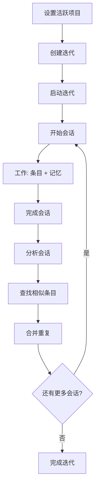

# Itera MCP — AI Agent 工作流

## 概览

Itera MCP 提供 42 个工具用于结构化 AI 辅助开发，涵盖项目管理、迭代规划、会话建模、维度标签知识积累和去重清理。



---

## 工作流一：项目初始化

**场景**: 首次接触一个项目。

```
1. find_or_create_project(name="my-app")
2. list_projects()                       → 验证项目已创建
3. get_preset_tags()                      → 了解 7 个维度标签
4. list_tags(project_id="...")           → 查看项目已有标签
```

**约束规则**:
- 项目首次创建时自动初始化 7 个预设标签（`architecture`、`implementation`、`risk`、`decision`、`pattern`、`integration`、`quality`）
- 每个项目标签总数上限 30 个
- 谨慎使用 `add_tag()`，仅在预设标签完全不适用时才新增自定义标签

---

## 工作流二：迭代规划

**场景**: 开始一个新的开发周期。

```
1. create_iteration(name="Sprint 1", goal="实现用户认证", start_date="2026-05-26")
2. add_item(type="requirement", title="JWT 认证中间件", priority="high", iteration_id="...")
3. add_item(type="requirement", title="用户注册 API", priority="medium", iteration_id="...")
4. add_item(type="bug", title="登录跳转异常", priority="high", severity="major")
5. start_iteration(iteration_id="...")
```

**约束规则**:
- 需求条目（requirement）**必须**通过 `iteration_id` 关联到迭代
- Bug 条目**可以不**关联迭代（项目级 Bug 允许）
- 同一时间只能有一个 `active` 状态的迭代
- 先完成当前迭代再启动新迭代（可用 `force=true` 强制覆盖）

---

## 工作流三：每日会话（核心循环）

这是 **AI 每次开始工作** 时执行的主要流程，强制执行 会话 → 工作 → 分析 → 清理 的闭环。

### 阶段 3.1：会话开始

```
1. start_session(title="实现 JWT 中间件")
2. list_tags()                                    → 确认可用标签
3. get_project_context()                          → 获取项目状态快照
4. get_suggestions(limit=3)                       → 获取推荐的下个任务
```

### 阶段 3.2：工作执行

```
1. start_item(id="item-123")                     → 将条目移入 in-progress
2. update_item(id="item-123", description="...") → 补充详情
3. add_memory_entry(
     type="fact",
     content="JWT 密钥从环境变量 JWT_SECRET_KEY 加载",
     tag_names=["implementation"],
     merge_similar=true
   )
4. add_memory_entry(
     type="decision",
     content="选择 HS256 而非 RS256，简化密钥管理",
     tag_names=["decision"],
   )
5. search_memory(query="JWT")                     → 查找已有知识
6. search_conclusions(tag_names=["risk", "pattern"]) → 读取历史结论
```

### 阶段 3.3：会话关闭

```
1. complete_session(
     session_id="...",
     summary="实现了 /api/* 路由的 JWT 中间件。Token 过期时间：24h。中间件链：auth → rbac → audit。"
   )
```

### 阶段 3.4：分析复盘

```
1. analyze_session(
     session_id="...",
     session_summary="实现了 JWT 中间件...",
     conclusions=[
       {tag_name: "architecture", content: "JWT 中间件链：auth→rbac→audit，无状态 token + refresh", confidence: "high"},
       {tag_name: "implementation", content: "HS256 签名，24h 过期，从 sub 提取用户，注入 request 上下文", confidence: "high"},
       {tag_name: "risk", content: "测试中 token 硬编码，上线前需要环境变量注入", confidence: "medium"},
       {tag_name: "decision", content: "选择 HS256 而非 RS256：更简单的密钥管理，适合单体应用", confidence: "medium"},
       {tag_name: "pattern", content: "责任链模式实现中间件：每个处理器验证后委托给下一个", confidence: "high"},
     ]
   )
   → 返回: { conclusions_added: 5, missing_tags: ["integration", "quality"] }

2. # 补充缺失维度
   add_conclusion(
     session_id="...",
     tag_name="integration",
     content="无外部认证服务依赖，自包含 JWT 方案",
     confidence="high"
   )
   add_conclusion(
     session_id="...",
     tag_name="quality",
     content="已添加 JWT 过期测试套件；token 刷新功能下个会话实现",
     confidence="medium"
   )
```

### 阶段 3.5：去重清理

```
1. find_similar_items(threshold=0.6)
   → 返回相似记忆/结论的配对列表

2. 对每个建议的配对:
   merge_items(entity_type="memory", keep_id=10, remove_id=23)
   # keep_id = 内容更完整的那条
   # remove_id = 重复/较短的被合并项
```

---

## 工作流四：状态流转

### 需求条目生命周期

```
backlog → todo → in-progress → done
```

- `start_item(id)` → 移入 `in-progress`
- `complete_item(id)` → 移入 `done`
- `update_item_status(id, status)` → 直接状态跳转

### Bug 条目生命周期

```
backlog → todo → in-progress → reproduced → verified → done
```

- `reproduce_bug(id)` → 移入 `reproduced`
- `verify_bug(id)` → 移入 `verified`
- `complete_item(id)` → 移入 `verified`（对 Bug 而言）

---

## 工作流五：知识检索

开始新会话时，**务必**先拉取历史上下文：

```python
# 1. 读取相同项目的历史记录
search_memory(query="auth", tag_names=["architecture", "implementation"])
search_conclusions(tag_names=["risk"], query="security", confidence="high")

# 2. 检查待办工作
get_active_iteration()             # 当前 Sprint 及其条目
get_suggestions(limit=5)           # 建议下一步做什么

# 3. 完整上下文快照
get_project_context()               # 项目 + 迭代 + 最近活动 + 关键记忆
get_summary()                       # 统计：各类型/状态的条目数
```

---

## 完整生命周期示例

```
# === 项目初始化（一次性） ===
find_or_create_project(name="ecommerce-api")
set_active_project(project_id="proj-abc123")
create_iteration(name="v1.0", goal="核心结账流程")
start_iteration(iteration_id="iter-xyz")
add_item(type="requirement", title="购物车 API", ...)
add_item(type="requirement", title="结账 API", ...)
add_item(type="requirement", title="支付集成", ...)
start_iteration(iteration_id="iter-xyz")

# === 会话1：购物车 API ===
start_session(title="实现购物车 API", iteration_id="iter-xyz")
get_project_context()
start_item(id="item-cart")
  ... AI 实现购物车功能 ...
add_memory_entry(type="fact", content="购物车数据存储在 Redis，TTL 24h", tag_names=["implementation"])
add_memory_entry(type="decision", content="选择 Redis 而非 PostgreSQL：临时数据读写更快", tag_names=["decision"])
add_memory_entry(type="pitfall", content="Redis 连接池在 1000+ 并发时耗尽，需使用 sentinel", tag_names=["risk"])
complete_item(id="item-cart")
complete_session(session_id="sess-1", summary="构建了基于 Redis 的购物车 CRUD...")
analyze_session(... 覆盖 7 个标签的结论 ...)
find_similar_items(threshold=0.6)

# === 会话2：结账 API ===
start_session(title="实现结账 API", iteration_id="iter-xyz")
get_project_context()
search_conclusions(tag_names=["architecture", "risk"])
  → 返回: "购物车数据存储在 Redis，TTL 24h"
  → 返回: "Redis 连接池问题..."
start_item(id="item-checkout")
  ... AI 工作，已知悉之前会话的 Redis 风险 ...
add_memory_entry(type="pitfall", content="Redis 连接池：基于负载配置连接池大小", tag_names=["risk"], merge_similar=true)
  → 自动合并到之前的 Redis 踩坑记忆
complete_item(id="item-checkout")
complete_session(session_id="sess-2", summary="结账模块验证购物车、应用折扣...")
analyze_session(... 各维度结论 ...)
find_similar_items(threshold=0.6) → 发现重复的 Redis 记忆 → merge_items(...)
```

---

## AI 行为约束速查表

| 类别 | 规则 |
|------|------|
| **会话** | 每个项目只能有一个活跃会话；必须先完成分析再开新会话 |
| **标签** | 上限 30 个；7 个预设标签不可删除；自定义标签用小写连字符格式 |
| **记忆** | 事实与观点分离；自动合并相似条目（`merge_similar=true`） |
| **结论** | 必须标注可信度（high/medium/low）；每个标签每个会话 upsert 操作 |
| **条目** | 需求条目需要 `iteration_id`；Bug 可跳过；按状态流转路径操作 |
| **分析** | 每次 `analyze_session` 最多 10 条结论；力求覆盖全部 7 个预设标签 |
| **去重** | 每个会话结束后运行 `find_similar_items`；谨慎合并，保留信息 |
| **错误处理** | 不可忽略 `success: false` 响应，必须向用户报告 |

---

## 快速参考：42 个工具按阶段分类

| 阶段 | 工具 |
|------|------|
| **项目** | `find_or_create_project`、`update_project`、`get_project`、`list_projects`、`set_active_project` |
| **迭代** | `create_iteration`、`start_iteration`、`complete_iteration`、`get_iteration`、`list_iterations`、`add_item_to_iteration`、`remove_item_from_iteration` |
| **条目** | `add_item`、`update_item`、`list_items`、`get_item`、`delete_item` |
| **状态** | `update_item_status`、`start_item`、`complete_item`、`reproduce_bug`、`verify_bug` |
| **查询** | `get_active_iteration`、`get_suggestions`、`get_summary`、`get_project_context` |
| **记忆** | `add_memory_entry`、`update_memory_entry`、`search_memory`、`list_memory`、`crystallize_context`、`get_recent_activity` |
| **会话** | `start_session`、`complete_session`、`get_session`、`list_sessions` |
| **标签** | `list_tags`、`add_tag`、`get_preset_tags` |
| **结论** | `add_conclusion`、`search_conclusions`、`get_session_conclusions`、`get_conclusion` |
| **分析** | `analyze_session` |
| **去重** | `find_similar_items`、`merge_items` |